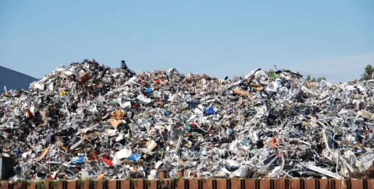
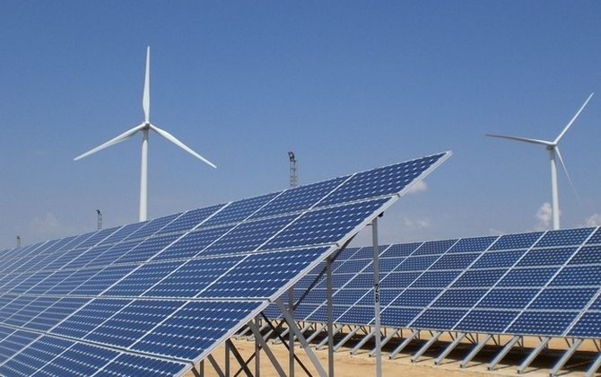
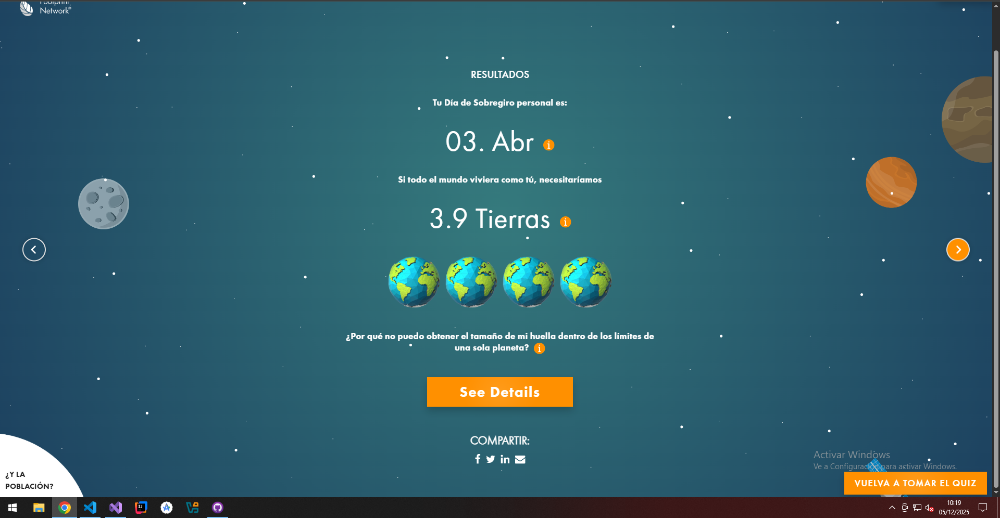
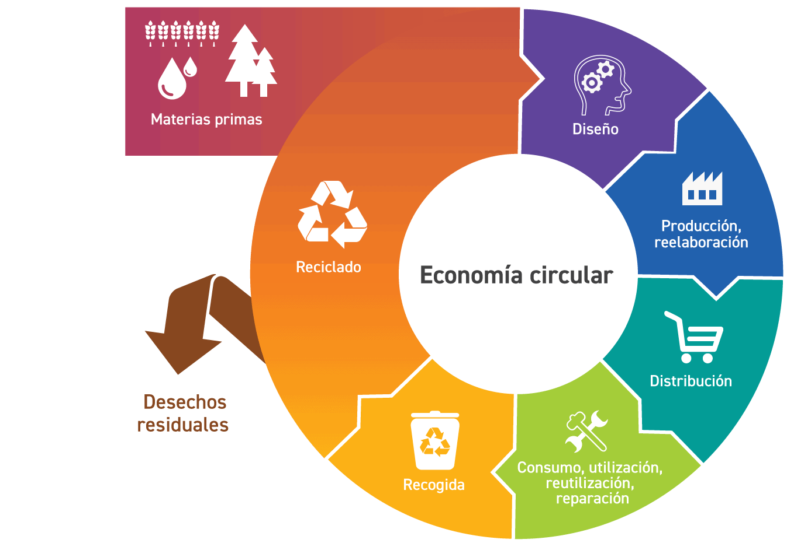
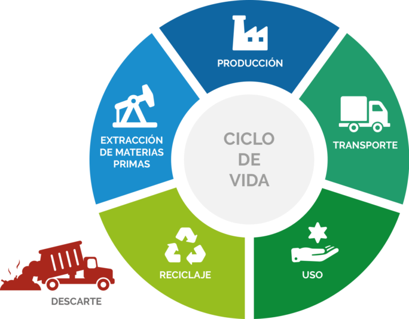

# SOSTENIBILIDAD

### SESION 12 - 09.01.2026
#### RESIDUOS
En la clase de hoy hemos hablado sobre la contaminación y los residuos que generamos. Una de las cuestiones que han surgido ha sido qué son los residuos, cuya definición es cualquier sustancia u objeto que su poseedor deseche o tenga la intención de desechar.

También hemos tratado el concepto de bioacumulación, es decir, cómo esos desechos se van acumulando a lo largo de los distintos procesos por los que pasan y cómo pueden afectar a nuestro organismo. Este fenómeno puede entenderse de manera sencilla mediante el siguiente símil: los peces acumulan mercurio, y cuanto menor es su tamaño, menor cantidad de mercurio contienen. Sin embargo, los peces más grandes se alimentan de los pequeños y, de este modo, van acumulando no solo el mercurio que generan, sino también el que ya estaba presente en los peces que consumen.

Dado que los seres humanos nos encontramos en lo alto de la cadena alimentaria, terminamos acumulando todo ese mercurio. Trasladando este ejemplo al concepto de bioacumulación, podemos observar un proceso similar con los microplásticos que generamos y cómo estos se van propagando y acumulando cada vez más en el medio ambiente y en los organismos vivos.

Respondiendo a la pregunta de hoy, ¿Por que cambiaste tu último movil? Pués en mi caso fue porque mi abuela necesitaba un móvil mejor y yo recientemente había comprado uno, aproveché y compré el móvil que yo quería y le di el mío "antiguo" a mi abuela.

#### REFLEXIÓN PERSONAL
Tras lo visto en clase, considero que la contaminación y la generación de residuos son problemas mucho más graves de lo que solemos percibir en nuestro día a día. Muchas veces no somos conscientes de que los residuos que desechamos no desaparecen, sino que permanecen en el medio ambiente y acaban afectando tanto a los ecosistemas como a nuestra propia salud.

### SESION 11 - 12.12.2025
Cambio climatico. Porque el cambio climatico preocupa el ministerio del exterior. ¿Cual es el principal emisor de C02? ¿Qué sistemas te podrían pedir para combatir el cambio climatica en nuestro sector?

En esta clase hemos visto porque el cambio climatico puede ser una preocupación para el ministerio del exterior de un país. El principal motivo es que el cambio climatico, como bien indica su nombre, produce cambios a los que nos tenemos que adaptar y si esa adaptación no depende solo de un país pueden haber conflictos. Respondiendo a las preguntas de hoy:

¿Cuál es el principal emisor de CO2? A nivel global, el principal emisor de CO2 es el sector energético, a la hora de producir calor o electricidad con la quema de combustibles fósiles.

Dentro del sector de la informatica ¿Qué sistemas te podrían pedir para combatir el cambio climatico? Primero de todo te podrían pedir que diseñases un sistema para saber el consumo de energía. Una vez tenga el sistema del consumo de energía, te pedirían que optimizases los procesos que se hagan en tu empresa para consumir menos energía. Un ejemplo podría ser cambiar las pantallas a unas mas eficientes o las fuentes de alimentación de los ordenadores o cambiar el tipo de energía a una renovable como puede ser la energía solar.

### SESION 10 - 05.12.2025
Huella ecologica o huella de carbono. Demanda vs Oferta es la contabilidad de los recursos, comparamos lo que consumimos con lo que la tierra puede generar. Unidad de medidad Hectareas globales. Principal causa del cambio climatico emisiones de CO2. Respondiendo a la pregunta de hoy de cual es nuestra huella de carbono.

En la clase de hoy hemos visto que es la Huella ecologica y como afecta a nuestro planeta tierra. Una definición de huella ecologica podría ser la comparación entre los residuos que generamos con los que el planeta Tierra puede digerir. Esto se puede medir en la contabilidad de los recursos es decir la cantidad de recursos que consmimos con la cantidad que la tierra puede generar. También hemos visto que actualmenta la principal causa de la huella ecologica es la huella de carbono es decir el CO2 que emitimos.

Respondiendo a la pregunta, cual es nuestra huella de carbono, a través de la página web footprintcalculator.org podemos sacar un estimación, en mi caso:

Lo que nos quiere decir es que si todas las personas llevasemos ese mismo ritmo de vida para durar un año necesitariamos 5.2 tierras cosa que no es sostenible claramente.

### SESION 9 - 28.11.2025
Hoy en clase hemos visto la diferencia entre la economía líneal y la economía circular sobre todo centrandonos en la circular. También como la sociedad se ha ido dando cuenta de que la economía circular no solo es mas sostenible, si no que también hay un buen negocio y generan mas trabajo y menos residuos. Siguiendo con la pregunta de hoy: ¿En que nos afecta el ecodiseño? Sabiendo que el ecodiseño es un enfoque de diseño que incorpora criterios ambientales en la creación de un producto o servicio con el objetivo de minimizar el impacto medioambiental durante todo el ciclo de vida de ese producto o servicio. El ecodiseño nos influye tanto a los consumidores como a las empreses. Por ejemplo, los consumidores tendremos productos con mayor eficiencia energética, que generen menos residuos etc, y para las empresas ahorro en el costo de materiales y gestión de los residuos, innovación en el mercado con productos mas "sostenibles" etc. En resumen el ecodiseño es una manera de sostenibilidad del medioambiente a la par que creación de negocio.

### SESION 8 - 14.11.2025
La diferencia de fecha de 2 semenas se debe a que en la anterior clase el profesor no asistió, por lo que no vimos ningún tema. 
En la clase de hoy hemos visto que es el analisis del ciclo de vida, es decir, un método para calcular el peso oculto de los productos que elaboramos los seres humanos. ¿Qué es el peso oculto?, la cantidad de materiales y recursos usados para producir y transportar un producto que no se refleja en su peso final. Este metodo sirve para evaluar los impactos medioambientales de un producto o proceso desde su fabricación hasta su disposición final.

¿Cuál es el peso oculto que se generá desde el punto en el cual se embala un altavoz hasta que llega a la puerta de tu casa? Respuesta según la IA:

> Siguiendo la metodología ACV, el “peso oculto” generado desde que un altavoz se embala hasta que llega a tu casa suele estar en el rango:
>10 a 20 kg de peso oculto por unidad

>Dependiendo de:
>País de origen, 
>materiales del embalaje,
>distancia y medios de transporte,
>eficiencia logística

### SESION 7 - 31.10.2025
En la sesion de hoy hemos visto información sobre los recursos de la tierra y si estos son finitos o no. ¿Es la tierra infinita? Esta era una de las preguntas que hemos respondido, la cual su respuesta es no porque los recursos de la tierra son finitos, al menos los que necesitamos los humanos para continuar con nuestra especie, es cierto que aunque sean finitos, no sabemos cuando se nos van a acabar. Hay 3 facetas dentro de la sostenibilidad del planeta segun nos concierne a los humanos, social, ambiental, economica. Hay que tener un equilibrio de las 3 para poder aguantar el maximo tiempo como especie. Respecto a la medida de sostenibilidad que he escogido es reducir el consumo de papel digitalizando los archivos que no sean necesarios en papel.

### SESION 6 - 24.10.2025
Al principio de la sesi&oacute;n hemos visto el contenido que tenemos que entregar sobre el proyecto grupal. Estrategia K y Estrategia R estas estrategias explican diferentes patrones de crecimientos poblacional y su impacto en los ecosistemas. ¿Qu&eacute; estrategia usamos los humanos? La especie humana utiliza la estrategia K porque los humanos tenemos pocos hijos en promedio, se dedican años al cuidado de los mismos y vivimos en un ambiente estable.

### SESION 5 - 17.10.2025
Hoy hemos visto las diferentes relaciones entre especies y las relaciones entre los seres humanos. ¿Que hacemos nosotros, cooperamos o competimos? Si hablamos de los seres humanos depende, porque hacemos ambas, siempre estamos cooperando y compitiendo a la misma vez, por ejemplo dos equipos de trabajo que copeeran para competir entre ellos, el fin podríamos decir que siemrpe es el mismo, sobrevivir como especie por eso cooperamos entre nosotros al igual que competimos.

### SESION 4 - 10.10.2025
No he podido asistir a clase. Mis compañeros me han comentado que se estuvo hablando del l&iacute;mite de carga de los ecosistemas. La pregunta del día ¿Hay un l&iacute;mite para la poblaci&oacute;n humana? Como para todo hay un l&iacute;mite, y mas si queremos sobrevir, si extinguimos los recursos naturales, no podr&iacute;amos sobrevir por eso hay que encontrar una balanza de consumo.

### SESION 3 - 03.10.2025

En esta clase hemos visto sobre si los humanos somos o no animales y las diferencias que tenemos con los dem&aacute;s animales. Tambi&eacute;n sobre si los humanos podemos acabar la vida en el planeta. Conclusión: La humanos podr&iacute;amos acabar con nuestra especie (porque somos animales, aunque distintos a los demas por nuestra capacidad de comunicaci&oacute;n) pero con la vida en el planeta son palabras mayores porque hay unidades de vida muy pequeñas como pueden ser las bacterias, las celulas, etc...

### SESION 2 - 26.09.2025

En esta clase hemos empezado a ver las transparencias, donde se ha explicado el termino de sostener, sostenibilidad y sostenibilidad actual y los tres factores de la sostenibilidad, que no es solo tiene que ver con el medio ambiente (ecol&oacute;gico, social, econ&oacute;mico). Tambi&eacute;n la diferencia entre ecolog&iacute;a y ecologismo. Conclusi&oacute;n: La conclusi&oacute;n es que sin investigar bien el asunto no se pueden ver los intereses de cada pol&iacute;tica.

### SESION 1 - 19.09.2025

En esta clase hemos visto el funcionamiento del m&oacute;dulo de sostenibilidad. El diario que tenemos que llevar d&iacute;a a d&iacute;a y el proyecto de la p&aacute;gina web que tenemos que hacer sobre una civilizaci&oacute;n y la sostenibilidad de la misma.